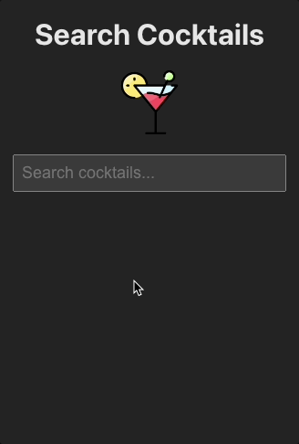

# AutoComplete Component [[DEMO]](https://autocomplete-lsoffici.vercel.app/)



## Summary

This repository contains an `AutoComplete` component built in React with TypeScript with no third party dependencies added. As an example, it is implemented to fetch cocktails from [TheCocktailDB](https://www.thecocktaildb.com/) API. Project is deployed on [Vercel](https://vercel.com/) and can be accessed [here](https://autocomplete-lsoffici.vercel.app/).

## Features

- **User Input**: The component allows users to type a search term into an input field.
- **Highlighting**: It highlights the search term in the suggestion list.
- **Minimum Characters**: It requires a minimum number of characters (default: 1) to trigger a search. The minimum character count can be customized.
- **Maximum Length**: The input field has a maximum allowed length (default: 25), which can also be customized.
- **Custom Options**: You can provide an array of options to be suggested, each consisting of a label and a value. The label is displayed in the suggestion list, and the value is passed to the `onSelect` callback when an option is selected.
- **Loading Indicator**: It supports indicating when data is loading (e.g., fetching suggestions from an API).
- **Selection**: Users can select an option from the suggestion list, and a callback function `onSelect` can be triggered when an option is selected.
- **Debouncing**: To reduce the number of API calls or computations, the component uses debouncing. It waits for a brief delay (default: 300 milliseconds) after the user stops typing before initiating the search.
- **Search Callback**: The component expects a callback function `onSearch` to handle search queries. It passes the current search term to this callback when a search is triggered. This callback can be used to implement your search logic. It is triggered after the user stops typing and the delay has passed. The callback is not triggered if the search term is empty or does not meet the minimum character count.
- **Selection Callback**: Optionally, you can provide a callback function `onSelect` to handle the selection of an option from the suggestion list. This callback receives the selected option (label and value).
- **Placeholder**: You can set a custom placeholder text for the search input field (default: "Search...").
- **Unit Tests**: The component is unit tested with [React Testing Library](https://testing-library.com/docs/react-testing-library/intro/).

> **_NOTE:_** The AutoComplete component does not implement any fetch logic. Instead, it expects a callback function `onSearch` that can be used to implement your search. In this example, the custom hook `useFetch` is used to fetch data from the API. I recommend using tools like TanStack's [React Query](https://react-query.tanstack.com/) or [SWR](https://swr.vercel.app/) to handle data fetching and caching. However, I did not use them in this example to avoid adding third party dependencies. Instead, I implemented a custom hook `useFetch` to fetch data from the API but did not implement any caching logic. You can use any other method to fetch data.

## Props

| Prop Name       | Type                                                 | Default Value        | Description                                                                       |
| --------------- | ---------------------------------------------------- | -------------------- | --------------------------------------------------------------------------------- |
| `onSearch`      | `(searchTerm: string) => void`                       | Required             | A callback function to handle search queries.                                     |
| `isLoading`     | `boolean`                                            | Optional             | Indicates whether the component is currently loading data.                        |
| `onSelect`      | `(option: { label: string; value: string }) => void` | Optional             | A callback function to handle selection of an option from the suggestion list.    |
| `options`       | `Array<{ label: string; value: string }>`            | `[]`                 | An array of options to display as suggestions.                                    |
| `placeholder`   | `string`                                             | `"Search..."`        | The placeholder text for the search input field.                                  |
| `minCharacters` | `number`                                             | `1`                  | The minimum number of characters required before triggering a search.             |
| `maxLength`     | `number`                                             | `25`                 | The maximum allowed length for the search input.                                  |
| `delay`         | `number`                                             | `300` (milliseconds) | The delay in milliseconds before triggering a search after the user stops typing. |

## Example Usage

```jsx
import AutoComplete from "./AutoComplete";

function MyComponent() {
  const handleSearch = (searchTerm) => {
    // Implement your search logic here
  };

  return (
    <AutoComplete
      onSearch={handleSearch}
      isLoading={false}
      options={[]}
      placeholder="Search something..."
    />
  );
}
```

## How to Run

- Clone the repository
- Run `npm install` or `yarn install`
- Development mode: Run `npm run dev` or `yarn dev`
- Production build: Run `npm run build` or `yarn build`
- Tests: Run `npm run test` or `yarn test`
- Linting: Run `npm run lint` or `yarn lint`
